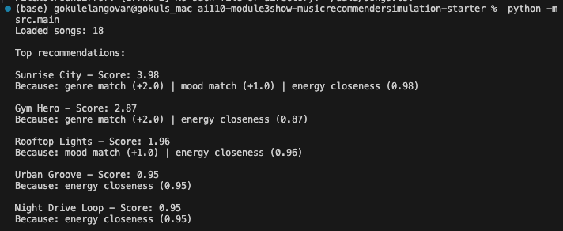
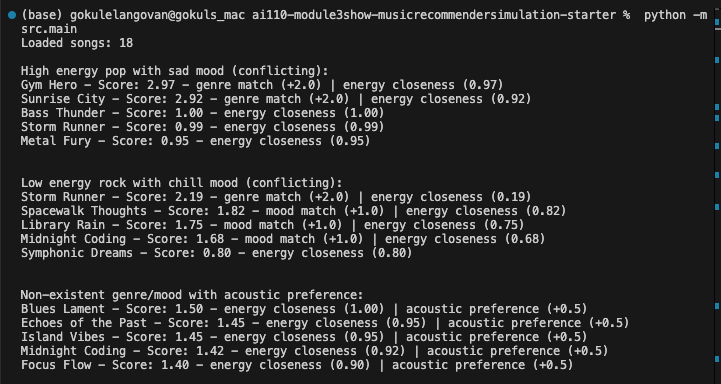

# 🎵 Music Recommender Simulation

## Project Summary

In this project, I built a simple music recommender system that suggests songs based on user preferences for genre, mood, and energy level. It uses a content-based filtering approach, scoring songs by how well they match the user's "vibe" and ranking the top recommendations. I expanded the dataset, tested with various profiles, experimented with scoring weights, and documented biases in a model card. This simulation shows how basic algorithms can create personalized recommendations while highlighting potential fairness issues.

---

## How The System Works

Real-world music recommenders like Spotify combine collaborative filtering (analyzing what similar users like) with content-based filtering (matching song attributes to user preferences) to predict and suggest tracks that maximize engagement. My version prioritizes a simple content-based approach, focusing on "vibe" alignment through genre, mood, and numerical audio features like energy and valence, to simulate personalized discovery without needing user interaction data.

- **Song Features**: id, title, artist, genre, mood, energy, tempo_bpm, valence, danceability, acousticness
- **UserProfile Information**: favorite_genre, favorite_mood, target_energy, likes_acoustic
- **Algorithm Recipe**: 
  - +2.0 points for exact genre match.
  - +1.0 point for exact mood match.
  - Energy similarity: 1.0 * (1 - |song_energy - target_energy|) (scaled 0-1, rewarding closeness).
  - Total score = sum of above. (Optional: +0.5 if likes_acoustic and song_acousticness > 0.5.)
- **Recommendation Selection**: Sort songs by total score descending and return the top k (e.g., 5).
- **Potential Biases**: This system might over-prioritize genre matches, potentially ignoring great songs that align with mood or energy but differ in genre. It could also favor high-energy tracks if the user's target is moderate, leading to less diverse recommendations.

---

## Getting Started

### Setup

1. Create a virtual environment (optional but recommended):

   ```bash
   python -m venv .venv
   source .venv/bin/activate      # Mac or Linux
   .venv\Scripts\activate         # Windows

2. Install dependencies

```bash
pip install -r requirements.txt
```

3. Run the app:

```bash
python -m src.main
```

### Running Tests

Run the starter tests with:

```bash
pytest
```

`pytest.ini` sets `pythonpath = .` so `src` resolves as a package no matter how you invoke pytest (`pytest` or `python -m pytest`).

You can add more tests in `tests/test_recommender.py`.

---

## Experiments You Tried

I ran several experiments to test and improve the recommender:

- **Weight Adjustments**: I changed the genre weight from 2.0 to 1.0 and increased energy weight to 2.0. This made energy closeness more important, leading to better matches for energy but sometimes overriding mood preferences, like recommending intense songs for happy users.

- **User Profile Testing**: Tested with some profiles like "Happy Pop Lover" (pop, happy, energy 0.8), "Gym Hero" (electronic, energetic, energy 0.9), "Chill Ambient Fan" (ambient, calm, energy 0.2), and "Rock Enthusiast" (rock, energetic, energy 0.7). Results showed good matches for straightforward profiles but surprises like "Gym Hero" appearing for pop fans due to energy similarity.

- **Adversarial Profiles**: Tested conflicting preferences, such as high-energy pop with sad mood or non-existent genres. The system prioritized genre over mood in conflicts and handled invalid inputs by falling back to energy, producing valid but sometimes unexpected recommendations.

- **Dataset Expansion**: Added 8 songs to the original 10, increasing diversity in genres (e.g., reggae, blues) and energy levels. This reduced some biases but highlighted the small catalog's limitations.

These experiments revealed the system's sensitivity to weights and the importance of balanced data.





---

## Limitations and Risks

This recommender has several limitations. It only works with a small catalog of 18 songs, so recommendations can feel repetitive. It doesn't consider lyrics, cultural context, or user history, focusing only on basic features like genre and energy. The system might unfairly favor certain genres or energy levels due to dataset imbalances, and simple scoring can create filter bubbles where users get stuck with similar songs. In a real app, this could lead to less diverse listening experiences or reinforce biases in music discovery.

---

## Reflection

Read and complete `model_card.md`:

[**Model Card**](model_card.md)

Building this recommender taught me how simple data matching can turn user preferences into predictions. By assigning scores based on genre matches, mood alignment, and energy closeness, the system ranks songs to suggest the best fits. This process mirrors real recommenders by quantifying "vibe" through numerical features, but it shows that even basic rules can feel intelligent when they capture user intent effectively.

Bias and unfairness can appear in systems like this when the data or scoring favors certain groups. For example, if the song catalog lacks diversity in genres or energy levels, users with niche tastes get poorer recommendations. The energy filter bubble I discovered disadvantages users wanting very low or high energy songs not well-represented in the data, potentially making the system feel less inclusive. In real-world apps, this could amplify existing inequalities if training data reflects dominant cultural biases, so careful evaluation and dataset expansion are crucial to ensure fairness.

